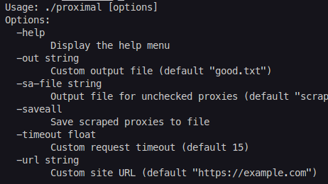
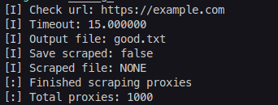

<h1 align="center">
  
</h1>

  A fast proxy webscraper and health checker
   
   
  <a href="https://github.com/nullsoepic/proximal/issues/new?assignees=&labels=bug&template=01_BUG_REPORT.md&title=bug%3A+">Report a Bug</a>
  ·
  <a href="https://github.com/nullsoepic/proximal/issues/new?assignees=&labels=enhancement&template=02_FEATURE_REQUEST.md&title=feat%3A+">Request a Feature</a>
  ·
  <a href="https://github.com/nullsoepic/proximal/issues/new?assignees=&labels=question&template=04_SUPPORT_QUESTION.md&title=support%3A+">Ask a Question</a>

 

---

## About

> **[?]**
> Whenever you're trying to get proxies for free   
> they often simply don't work, this is what proximal   
> intends to solve by letting you quickly scrape   
> and check proxies over HTTP or HTTPS and   
> check connections to specific sites   

Screenshots

 
  

|                               Help Menu                              |                               Startup Info                               |
| :------------------------------------------------------------------: | :----------------------------------------------------------------------: |
|  |  |

### Built With

> **[?]**
> Built with GoLang for great performance

## Getting Started

### Prerequisites

> **[?]**
> Using only the standard Go libraries

### Precompiled

> **[?]**
> Download the latest precompiled binary for your os from the [releases](https://github.com/nullsoepic/proximal/releases/latest) tab

### Building

> **[?]**
> 
> 0. Download and install Go - https://go.dev/dl/
> 1. Clone the repo - `git clone https://github.com/nullsoepic/proximal.git`
> 2. Build using `go build`

## Usage

> **[?]** Args:  
> NONE - `./proximal` - *Checks proxies with https://example.com*  
> `-help` - *Shows help menu*  
> `-out valid.txt` - *Specifies output file for working proxies* **Default: `valid.txt`**  
> `-url https://google.com` - *Checks proxies with specified url* - **Default: `https://example.com`**  
> `-saveall` - *Save all scraped proxies to a file* - **Default: `false`**  
> `-sa-file` - *Specifies output file for saving scraped proxies* - **Default: `scraped.txt`**  

## Support

> **[?]**
> If you'd like to contact me you can make a github issue or drop me a discord DM

- [GitHub issues](https://github.com/nullsoepic/proximal/issues/new?assignees=&labels=question&template=04_SUPPORT_QUESTION.md&title=support%3A+)
- [Discord](https://discord.com/users/706514153916858400)

## Contributing

First off, thanks for taking the time to contribute! Contributions are what make the open-source community such an amazing place to learn, inspire, and create. Any contributions you make will benefit everybody else and are **greatly appreciated**.

Please read [our contribution guidelines](docs/CONTRIBUTING.md), and thank you for being involved!

## Authors & contributors

The original setup of this repository is by [Vibing](https://github.com/nullsoepic).

For a full list of all authors and contributors, see [the contributors page](https://github.com/nullsoepic/proximal/contributors).

## License

This project is licensed under the [Nebula Software License](LICENSE) 1.0
